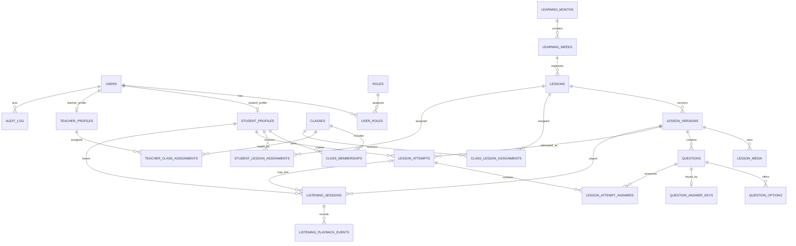

# English Academy — Database Design

**Document type:** Logical data model and PostgreSQL reference schema  
**Version:** 1.0  
**Status:** Draft for Backend/BA/IT review  
**Related requirements:** [English_Academy_FR_NFR_Requirements.md](./English_Academy_FR_NFR_Requirements.md)  
**Related task plans:** [Backend_Task_Breakdown.md](./Backend_Task_Breakdown.md), [Frontend_Task_Breakdown.md](./Frontend_Task_Breakdown.md)

## 1. Purpose and scope

This document proposes a normalized database structure for the English Academy web app: accounts and roles, classes, learning content, assignments, student attempts/results, actual media-playback time, reporting, and audit history. It is a starting design for review, not an approved production schema.

The implementation reference in [`database/schema.sql`](./database/schema.sql) uses PostgreSQL types and syntax. The selected database engine, hosting, media storage, security controls, and migration conventions must be confirmed with IT before applying it. The schema stores media metadata/references; it does not store large audio/video binaries in database rows.

## 1.1 Simplified MVP proposal

[`English_Academy_Database.dbml`](./English_Academy_Database.dbml) is a 15-table conceptual MVP proposal intended to make the ERD easier to review. It is not yet a replacement for the full 23-table PostgreSQL reference schema in `database/schema.sql`.

The proposal reduces the model by:

- Storing a single role plus optional Student/Teacher codes in `users`, instead of separate role and profile tables. This assumes one role per account and needs approval.
- Storing year, month, and week together in `learning_weeks`, instead of separate month and week tables.
- Deferring Teacher-to-class assignments, direct individual lesson assignments, and audit history until their MVP scope is confirmed.
- Keeping lesson versions, questions/options, protected answer keys, student attempts, and playback events because they preserve content history, grading, and Listening Time records.

The simplified answer table uses ordinary foreign keys. The Backend must validate that an answer's question belongs to the lesson version used by its attempt. The full SQL reference currently enforces that rule with composite foreign keys.

## 2. Design principles

- Student learning records are tied to the account. The full SQL reference uses a separate profile row; the simplified MVP proposal keeps Student/Teacher codes in `users`.
- Role authorization is enforced by Backend services. Database records alone do not replace authorization checks.
- Old published lesson content remains addressable so previous attempts can be interpreted against the content the Student actually received.
- Listening playback events are the source record; totals are derived from validated playback intervals, not from time that a page stayed open.
- Correct-answer data is stored separately from learner-facing question choices and must not be returned to Student APIs.
- Admin/Teacher permissions, class model, grading, retries, Listening Time edge cases, retention, and audit policy are decision items where marked TBD.

## 3. Entity relationship overview

## 4. Tables and responsibilities

| Table | Purpose | Notes |
|---|---|---|
| `users` | Login identity and account state for Student/Admin/Teacher accounts | Store password hash only; unique normalized username |
| `roles`, `user_roles` | Assign approved roles to users | Role list and whether users can hold multiple roles are policy decisions |
| `student_profiles`, `teacher_profiles` | Role-specific profile identifiers | Student learning data references `student_profiles` |
| `classes`, `class_memberships`, `teacher_class_assignments` | Class membership and teacher assignment | Conditional: customer mentions class filtering and assignment, but class lifecycle/rules need confirmation |
| `learning_months`, `learning_weeks` | Organize learning content by month and week | Calendar rules and week boundaries need agreement |
| `lessons`, `lesson_versions` | Stable lesson identity plus immutable published content versions | Version rows keep old content available for historical attempts |
| `lesson_media` | Audio/video file metadata and external links | Binary objects live in approved object/media storage |
| `questions`, `question_options`, `question_answer_keys` | Question content, learner-visible options, protected answer key | Question type validation and short-answer grading remain TBD |
| `class_lesson_assignments`, `student_lesson_assignments` | Assign lessons to classes and/or individual students | Whether individual and class assignment are both in scope must be confirmed |
| `lesson_attempts`, `lesson_attempt_answers` | Student progress, submissions, answers, scores, and activity times | Retry, completion, score visibility, and resubmission policies need agreement |
| `listening_sessions`, `listening_playback_events` | Playback session and event log for Listening Time | Do not accept a client-provided total as authoritative |
| `audit_log` | Optional trace of administrative changes | BA-proposed; confirm fields, access, and retention |

## 5. Important relationship and behavior decisions

### Lesson versioning

A `lesson` is a stable identity that can be assigned to classes/students. Content edits create a new `lesson_versions` row. Only one version per lesson may be marked current and published. Attempts reference the exact version taken, preserving historical question/media context. Do not overwrite or hard-delete a published version that has attempts.

### Assignments

Separate class and individual assignment tables preserve foreign-key integrity. Student lesson access is the union of currently applicable individual assignments and assignments to active classes the Student belongs to, subject to approved dates and permission rules. Define precedence and duplicate display behavior before API implementation.

### Listening Time

Store event IDs, event type, client event ID, client time, server receipt time, and media position. The Backend validates and computes credited intervals. Define what counts during pause, seek, repeat, speed change, background tabs, reconnect, and concurrent sessions. Daily/week/month totals may be computed from validated events or materialized into aggregates; aggregates must be rebuildable from the event log.

### Attempts and grading

A submission is tied to a Student and a lesson version. Store one answer record per attempt/question and the scoring result returned by the Backend. The answer key stays in a protected table/service boundary. Whether edits to a draft question affect existing attempts, whether learners can retry, and whether answer explanations are displayed remain TBD.

## 6. Candidate constraints and indexes

The PostgreSQL reference schema includes the initial uniqueness and lookup constraints. Confirm business keys and expected data volumes before production:

- Unique normalized username.
- Unique user/role pair.
- Unique month/year and week number within a month.
- Unique lesson version number within a lesson; at most one current version.
- Unique question order within a lesson version.
- Unique attempt number per Student and lesson version.
- Unique client event ID within a Listening session for idempotent event ingestion.
- Indexes for Student attempt history, class membership, assignment lookup, report filters, and playback time ranges.

## 7. Security and privacy notes

- Store an adaptive password hash produced by an approved authentication library; never store plaintext passwords.
- Keep answer keys out of Student responses; use least-privilege service access.
- Enforce per-user/class authorization in application services for reads and writes.
- Avoid storing unnecessary personal data; agree retention and account deletion/anonymization rules.
- Do not put credentials, answer keys, or sensitive Student data in application logs.
- Confirm encryption, backup, retention, and recovery controls with IT.

## 8. Clarifications required before final schema approval

1. Database engine/version and migration tool.
2. User roles, role hierarchy, whether multiple roles per user are permitted, and Admin/Teacher scope.
3. Whether Classes are first-class managed entities; membership dates, multiple class memberships, and Teacher assignment rules.
4. Whether lesson assignment supports both individual and class targets; assignment dates, due dates, and duplicate precedence.
5. Month/week calendar definition, timezone, and week boundary.
6. Lesson completion, scoring, manual short-answer marking, retries, resubmissions, and answer/result visibility.
7. Listening Time event protocol and edge-case credit rules.
8. Media formats, maximum file size, external link providers, storage provider, and retention.
9. Historical data retention, Student account removal, and content deletion/archive behavior.
10. Whether audit history, charts, Excel exports, parent accounts, Speaking, and future exercise modules are in MVP.
11. Expected concurrent users and data volumes. The example of 500 concurrent users / under 2 seconds is not stated in the supplied customer DOCX.

## 9. Implementation notes

`database/schema.sql` is a reference DDL proposal, not a migration ready to apply to production. Review it with Backend, BA, and IT; agree unresolved rules; then split approved DDL into versioned, reversible migrations. The schema avoids storing uploaded binary media and avoids assuming that a UI permission check provides data security.
