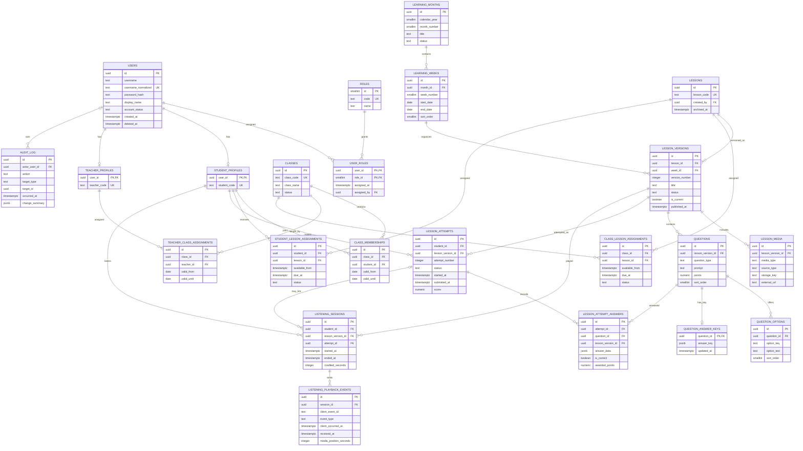

# English Academy — Database ER Diagram

The diagram below visualizes the PostgreSQL reference schema in [`database/schema.sql`](./database/schema.sql). It is a logical ERD; the SQL file is the source for exact column definitions and constraints.

## How to read it

- `||` means exactly one; `o|` means zero or one; `o{` means zero or many; `|{` means one or many.
- A Student or Teacher profile extends a user account. Role assignments are kept separately in `USER_ROLES`.
- A lesson has versioned content. Questions and media belong to a specific lesson version; attempts retain the version taken.
- A Student can receive a lesson through a class assignment, an individual assignment, or both, subject to approved rules.
- Attempt answers reference both an attempt and its lesson version/question so an answer cannot be attached to a question from a different lesson version.
- Listening sessions store validated credited time; playback events provide the trace used to calculate it. The event edge rules still need Product/BA agreement.
- `QUESTION_ANSWER_KEYS` is restricted grading data and must not be exposed through Student APIs.

## Scope caveats

Class management, Teacher-to-class assignments, individual lesson assignment, audit logging, and some role rules are conditional or require confirmation in the requirements. They are shown to make dependencies visible; their presence in this diagram does not independently approve them for MVP. See [Database_Design.md](./Database_Design.md) for design assumptions and open decisions.

